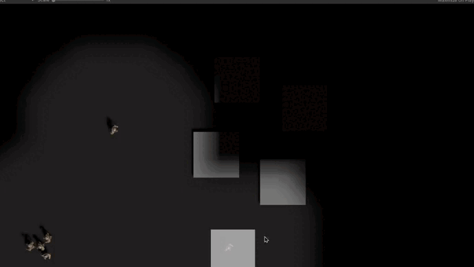
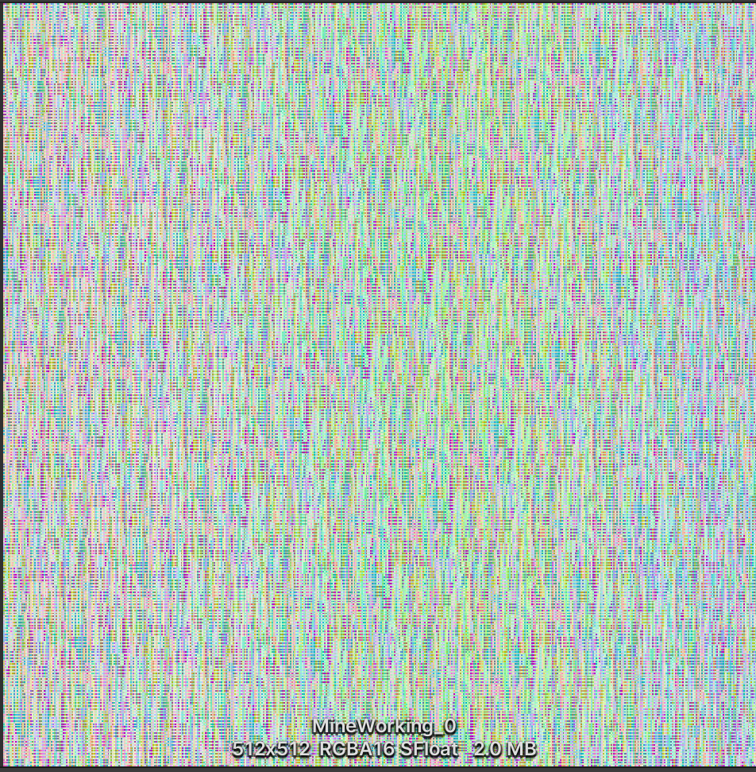

# Its A RTS Demo
it is a rts demo by **Unity**
# 🌞Overview🌞
## 🫱 Client **PURE** Unity ECS framework
- using Dots0.5, Pathfinding, Collision Avoidance and all logic about are written by Unity_ECS
## 🫱 Server multi-player Frame synchronization
- A simple frame synchronization server written by **Golang**
- Rooms and Matching  
- Use **protobuf** and **kcp** to communicate

# 🎉Show case🎉
 

    
 
☝️RVO Frame synchronization☝️

    
 
☝️fog of war☝️

    
 
☝️texture base vertex animation☝️

 
 
 

# 🔥Feature🔥

## 🫱 Deterministic fixed points
Default floating point precision issues can lead to failure to synchronize，necessary to rewrite a deterministic fixed-point numbers to make it Multi-client synchronization
> [帧同步的几个难点](https://www.cnblogs.com/yptianma/p/11781083.html)
> 
> [定点数原理](https://blog.csdn.net/qq_42461824/article/details/125609431)
## 🫱 [RVO2 Collision Avoidance ](https://github.com/MouseChannel/MCRVO)
rewriten by Unity ECS Framework
> [RVO2 lib](https://gamma.cs.unc.edu/RVO2/)
## 🫱 [Large map with multi-level pathfinding (HPA*)](https://github.com/MouseChannel/Hierarchical-Pathfind)
Hierarchy A-Star path finding
> [Hierarchy Pathfinding A-Star](https://www.researchgate.net/publication/228785110_Near_optimal_hierarchical_path-finding_HPA)
## 🫱 Texture-Base Shader Animation
shader vertex animation to rendered in ECS framework，each pixel represents the mesh **a certain vertex position in a certain frame**.
> [Unity GDC 2016: Rendering a Large Number of Animated Characters Using the GPU](https://www.youtube.com/watch?v=1ZPcXcCBFIs)
## 🫱 High performance fog of war
reuse the KD tree in RVO2 to get the nearest occlusion

 
